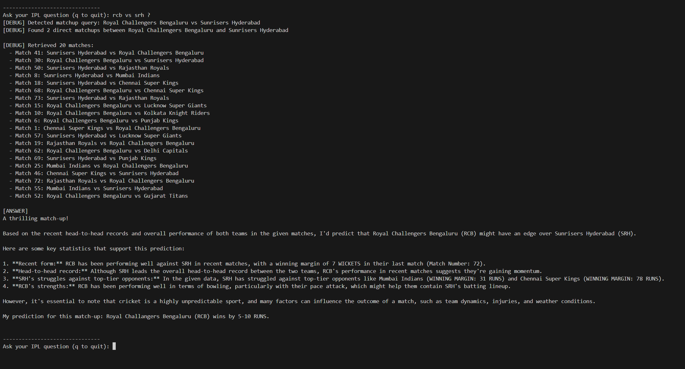

# IPL 2024 Query Assistant

A local Retrieval-Augmented Generation (RAG) system that answers natural language questions using IPL 2024 match data.  
It combines semantic vector search (via Chroma) with a locally hosted LLaMA3 language model (using Ollama) to generate accurate, offline responses.

## Sample Output

Below is a sample query and the corresponding response:

